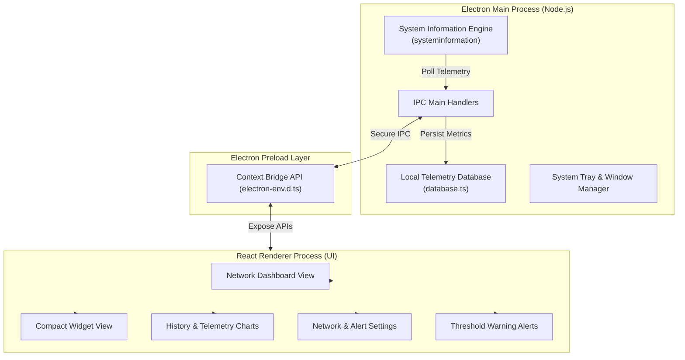

<div align="center">
  
  <h1>NSX Monitor</h1>
  <p><strong>Professional-grade network telemetry suite for high-precision bandwidth monitoring and analytics.</strong></p>

  <p>
    <a href="https://github.com/ichshakib/nsx-monitor/actions/workflows/ci.yml"></a>
    <a href="https://github.com/ichshakib/nsx-monitor/releases"></a>
    <a href="./LICENSE"></a>
  </p>
</div>

---

## ⚡ Overview

**NSX Monitor** is a powerful desktop application built to provide real-time insights into your network bandwidth, interface metrics, and historical telemetry data. Designed with a sleek modern UI and built on top of Electron, React, and TypeScript, it allows developers, network engineers, and power users to keep an eye on network health with minimal system overhead.

### ✨ Key Features

- 📊 **Real-time Telemetry:** Instant upload/download transfer rates, active connections, and latency tracking.
- 📈 **Historical Telemetry & Analytics:** Interactive data charts powered by Recharts with time filtering (1h, 24h, 7d, 30d).
- 🪟 **Compact Overlay Widget:** Switch effortlessly to a lightweight, always-on-top desktop widget mode.
- ⚠️ **Smart Bandwidth Alerts:** Configurable download/upload warning thresholds with system alert triggers.
- 🎛️ **Interface Management:** Automatic detection and switching between network interfaces (Ethernet, Wi-Fi, VPNs).
- 💾 **Local Data Persistence:** Lightweight embedded JSON database for secure, local telemetry persistence.

---

## 🏗️ Architecture



---

## 🚀 Getting Started

### Prerequisites

- [Node.js](https://nodejs.org/) (version 20 or higher)
- [pnpm](https://pnpm.io/) (version 9 or higher)

### Installation & Local Development

1. **Clone the repository:**
   ```bash
   git clone https://github.com/ichshakib/nsx-monitor.git
   cd nsx-monitor
   ```

2. **Install dependencies:**
   ```bash
   cd desktop
   pnpm install
   ```

3. **Launch in development mode:**
   ```bash
   pnpm run dev
   ```

4. **Run TypeScript check & Linting:**
   ```bash
   pnpm run typecheck
   pnpm run lint
   ```

5. **Build distributable installer:**
   ```bash
   pnpm run build
   ```
   *Packaged binaries will be generated inside `desktop/release/`.*

---

## 📁 Project Structure

```text
nsx-monitor/
├── .github/                  # GitHub Actions CI/CD workflows & issue/PR templates
│   ├── ISSUE_TEMPLATE/       # Bug report & feature request templates
│   ├── PULL_REQUEST_TEMPLATE.md
│   └── workflows/            # Automated CI & Release pipelines
├── .vscode/                  # Workspace settings and extension recommendations
├── desktop/                  # Electron + React application
│   ├── electron/             # Electron main process, IPC handlers & telemetry database
│   ├── public/               # Application assets, logos & multi-platform icons
│   ├── src/
│   │   ├── components/       # Dashboard, Widget, History, Warning & Settings UI
│   │   ├── App.tsx           # Application root & view switcher
│   │   ├── main.tsx          # React application entry point
│   │   └── index.css         # TailwindCSS v4 styles & theme design system
│   ├── electron-builder.json5 # Electron packaging & installer configuration
│   ├── package.json
│   ├── tsconfig.json
│   └── vite.config.ts
├── CONTRIBUTING.md           # Contribution guidelines & branching rules
├── CODE_OF_CONDUCT.md        # Community guidelines
├── LICENSE                   # MIT License
└── README.md
```

---

## 📬 Contact & Support

If you have questions, need assistance, or want to report an issue:

- 🐛 **Issue Tracker:** [Open an Issue](https://github.com/ichshakib/nsx-monitor/issues) for bug reports and feature requests.
- 💬 **Discussions & Feedback:** Start a thread in [GitHub Discussions](https://github.com/ichshakib/nsx-monitor/discussions).
- 👨‍💻 **Maintainer:** Shakib Khan ([@ichshakib](https://github.com/ichshakib))

---

## 🤝 Contributing

Contributions are warmly welcome! Please read through our [CONTRIBUTING.md](./CONTRIBUTING.md) to learn how to get started, make changes, and submit a pull request.

---

## 📄 License

This project is licensed under the MIT License - see the [LICENSE](./LICENSE) file for details.